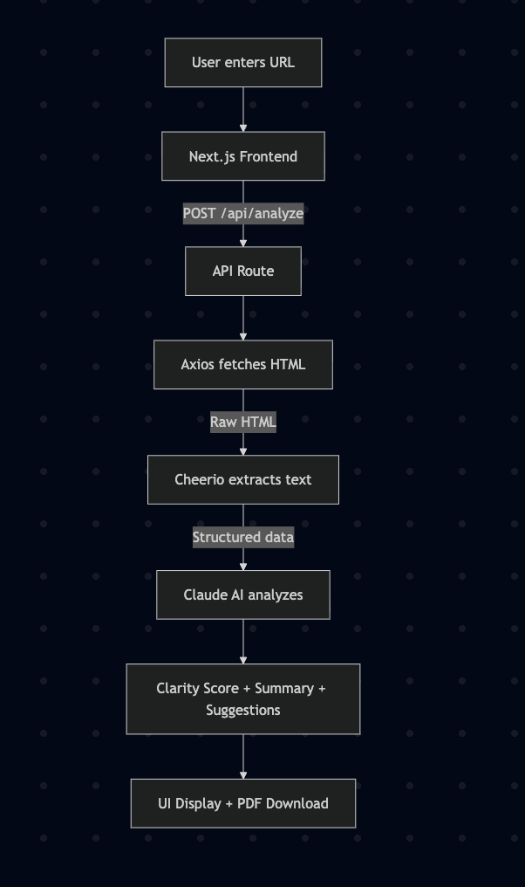
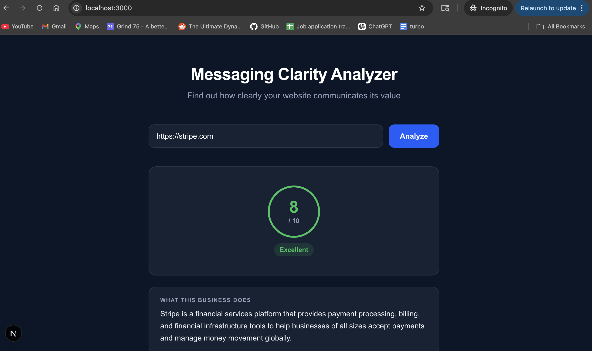
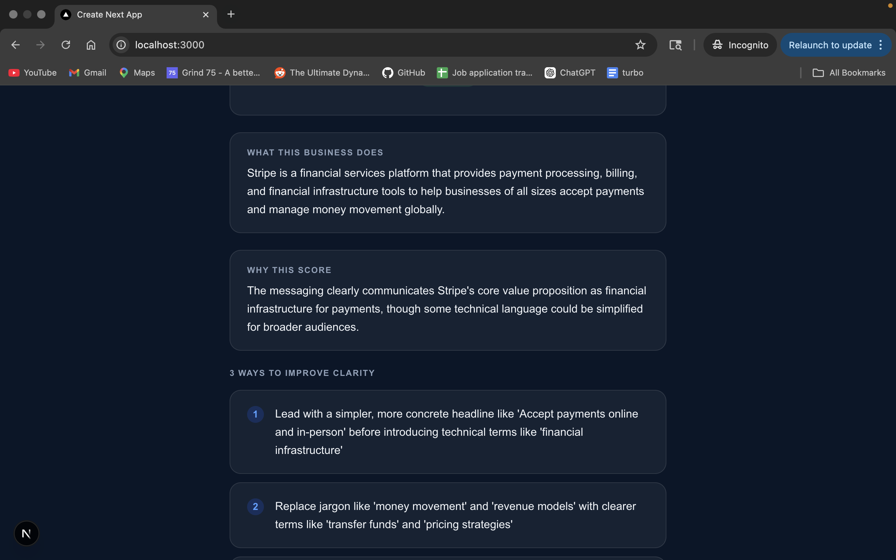
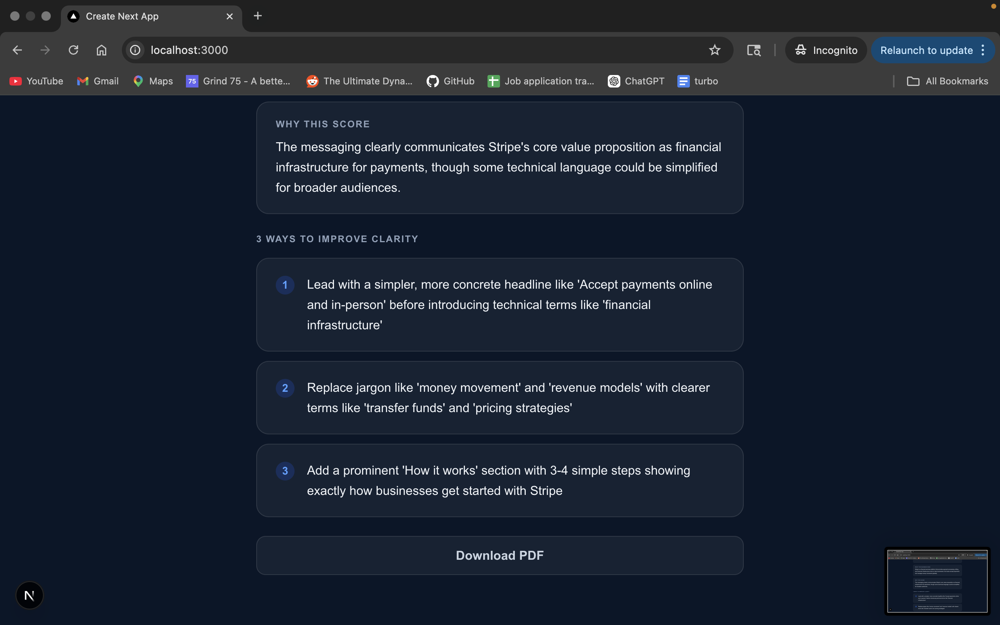

# Messaging Clarity Analyzer

Paste any website URL and get an AI-powered assessment of how clearly it communicates its value to visitors. The tool extracts key copy from the page — headlines, descriptions, CTAs — and returns a scored analysis with concrete suggestions to improve messaging clarity.

## Setup

```bash
git clone <repo-url>
cd messaging-clarity-tool
npm install
```

Add your Anthropic API key to `.env.local`:

```
ANTHROPIC_API_KEY=your_key_here
```

```bash
npm run dev
```

Open [http://localhost:3000](http://localhost:3000).


Add this section to README.md right after the title and description, before Setup:

Add this section to README.md right after the Live Demo section:

## 🎥 Demo Video (google drive link)
👉 [Watch Demo on Google Drive](https://drive.google.com/file/d/1nbsHX5smBDOCG_CvadnDXmurPQIbIkz6/view?usp=sharing)

## 🎥 Demo Video (large raw file)
[▶ Watch Demo](screenshots/demo_video.mov)

## 🌐 Live Demo
👉 [https://messaging-clarity-tool1-a9vbhs06a.vercel.app/](https://messaging-clarity-tool1-a9vbhs06a.vercel.app/)

## How it works

- **Scraping** — the API route fetches the target URL with axios and uses cheerio to extract the page title, meta description, H1/H2 headings, hero paragraph text, and CTA button copy
- **Analysis** — the extracted text is sent to Claude with a structured prompt that returns a clarity score (1–10), a plain-English reason for the score, a one-sentence business summary, and three actionable improvement suggestions
- **PDF export** — results can be downloaded as a two-page formatted PDF report via jsPDF, with a visual score circle and labeled sections

## Screenshots

### Architecture


### Home Page


### Analysis Results


### Full Report



## Example Output

```json
{
  "url": "https://stripe.com",
  "analyzedAt": "2026-05-06T16:45:00Z",
  "businessSummary": "Stripe is a financial infrastructure platform that enables businesses of all sizes to accept payments, manage billing, and handle global money movement through developer-friendly APIs.",
  "clarityScore": 8,
  "clarityReason": "Stripe's homepage immediately communicates its core value proposition with clear, jargon-free language and strong CTAs, though it could better highlight non-developer benefits.",
  "suggestions": [
    "Add a one-line tagline above the fold that speaks directly to non-technical decision makers, not just developers",
    "Include a 'Who it's for' section to help visitors self-identify quickly (startups, enterprises, marketplaces)",
    "Replace abstract hero text with a concrete outcome statement like 'Accept payments in 135+ currencies in minutes'"
  ]
}
```

## Tech stack

| | |
|---|---|
| **Framework** | Next.js 16 (App Router) |
| **Language** | TypeScript |
| **AI** | Claude (`claude-sonnet-4-20250514`) via Anthropic SDK |
| **Styling** | Tailwind CSS v4 |
| **PDF** | jsPDF |
| **Scraping** | axios + cheerio |
